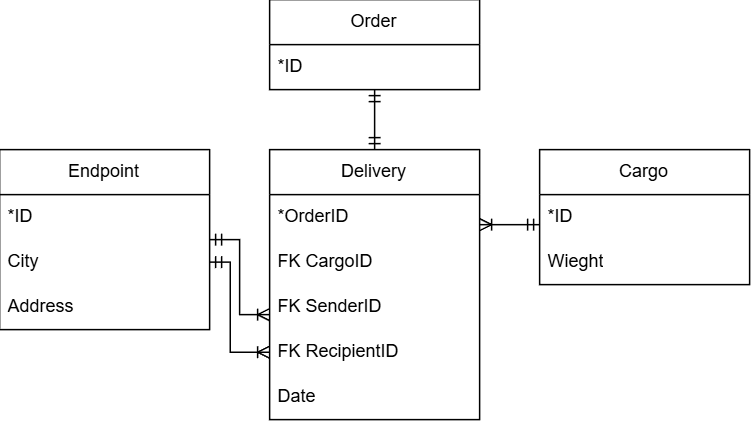

# Тестовое задание для кандидата в компанию Верста

## Структура репозитория

| Директория | Описание | Содержимое |
|:---|:---|:---|
| `versta/` | Основной исходный код | Модели, контроллеры и представления |
| ├─ `Models/` | Бизнес-логика и модели данных | Классы и интерфейсы реализующие бизнес-логику |
| ├─ `Controllers/` | Контроллеры | Контроллеры для Моделей и Представлений |
| ├─ `Views/` | Представления | Логика и разметка внешнего вида приложения |
| └─ `Shared/` | Общие вспомогательные классы | Прочие классы, не реализующие бизнес-логику |
| `db/` | База данных | Файлы базы данных |
| ├─ `ER-диаграмма.drawio` | ER диаграмма | Структура и связи сущностей БД. Посмотреть можно в сервисе [app.diagrams.net](https://app.diagrams.net) |
| └─ `pgsql_generate.sql` | Скрипт генерации БД | SQL запрос для генерации БД на PostgreSQL |
| `README.md` | Текущий файл | Документация проекта |

## Структура API 

| HTTP Method | URL | Метод контроллера | Описание |
|:---|:---|:---|:---|
| GET | `/` | `MainController.Index` | Редирект на `/orders/new` |
| GET | `/orders` | `MainController.GetOrderList` | Возврат списка заказов, включая данные по каждому заказу |
| GET | `/orders/new` | `MainController.GetOrderForm` | Возврат формы создания нового заказа |
| POST | `/orders/new` | `MainController.SaveOrder` | Сохранение данных о заказе в БД |

## Подход реализации frontend части проекта

Кандидату, согласно тексту задания, предлагается выбрать подход реализации frontend части проекта. Было принято решение использовать подход на основе ASP.NET Core MVC. Было принято использовать библиотеки **bootstrap** и **jquery**.

## База данных

Схема базы данных и скрипт генерации представлен в каталоге `db/`. Структура представлена на рисунке ниже:



Рисунок - ER-диаграмма

## Сборка и запуск

В качестве сборки использовалась IDE VisualStudio 2026, версия .NET - 9.0+, сборка Debug. Использованы следующие библиотеки:

* Microsoft.Extensions.PlatformAbstractions
* Npgsql.EntityFrameworkCore.PostgreSQL

Версия службы СУБД: postgresql-x64-18

> [!IMPORTANT]
> При разработке использовались внешние службы доставки (CDN) для некоторых статичных файлов. На запускаемой машине требуется подключение к интернету для корректного отображения фронта.

Ссылки на внешние подключаемые файлы:
* [Bootstrap Icons](https://cdn.jsdelivr.net/npm/bootstrap-icons@1.11.3/font/bootstrap-icons.min.css)
* [Плагин для jQuery - jQuery Validate](https://cdnjs.cloudflare.com/ajax/libs/jquery-validate/1.19.3/jquery.validate.js)
* [Дополнение к плагину - jQuery Unobtrusive Validation](https://cdnjs.cloudflare.com/ajax/libs/jquery-validation-unobtrusive/3.2.12/jquery.validate.unobtrusive.js)


### Подключение к БД

При разработке чувствительные данные были сохранены в отдельный файл по пути `/versta/.venv/config.json`, который не отслеживается системой контроля версий. Этот файл необходим для запуска, убедитесь что он существует по заданному пути. Его структура представлена ниже:

```json
{
  "DatabaseConnection": {
    "db_host": "****",
    "db_name": "****",
    "db_pass": "****",
    "db_user": "****",
    "db_port": "****"
  }
}
```

> [!IMPORTANT]
> Все ключи должны присутствовать. База данных должна быть создана до первого запуска проекта.

### Прочие настройки проекта

Также из индекса убран `/versta/Properties/launchSettings.json`, если он необходим, то создайте его и замените `"applicationUrl"` на свое значение (по умолчанию "http://localhost:<порт IIS сервера>"):

```json
{
  "$schema": "https://json.schemastore.org/launchsettings.json",
  "profiles": {
    "http": {
      "commandName": "Project",
      "dotnetRunMessages": true,
      "launchBrowser": false,
      "applicationUrl": "http://domain:port",
      "environmentVariables": {
        "ASPNETCORE_ENVIRONMENT": "Development"
      }
    }
  }
}
```